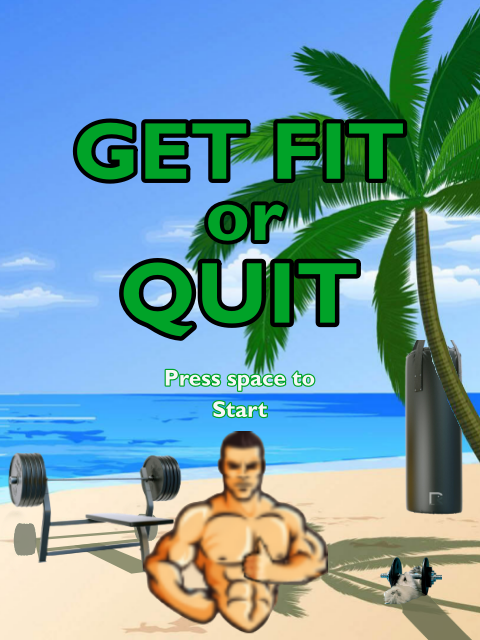
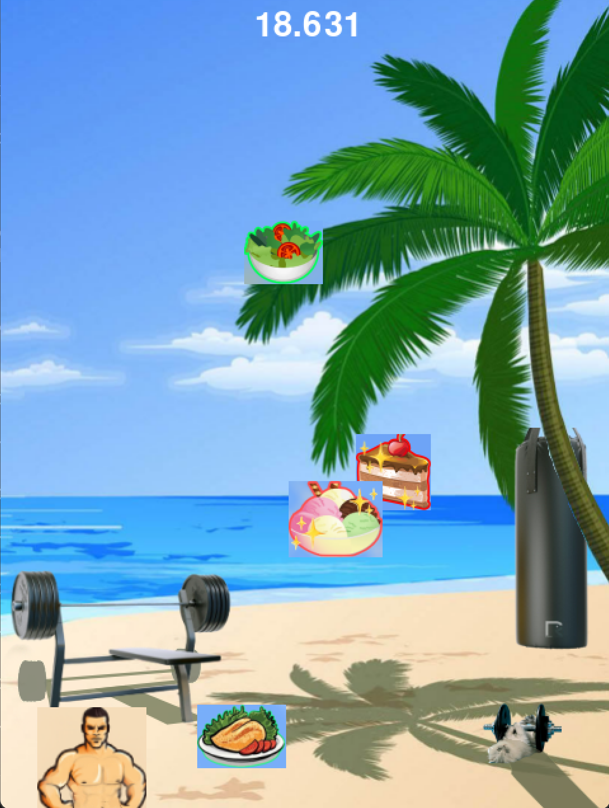
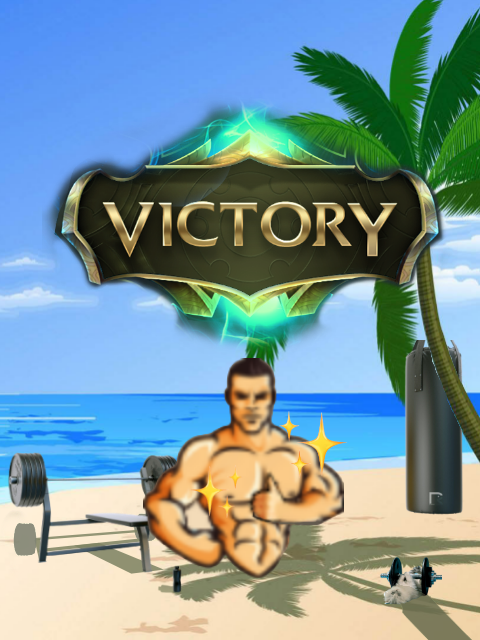
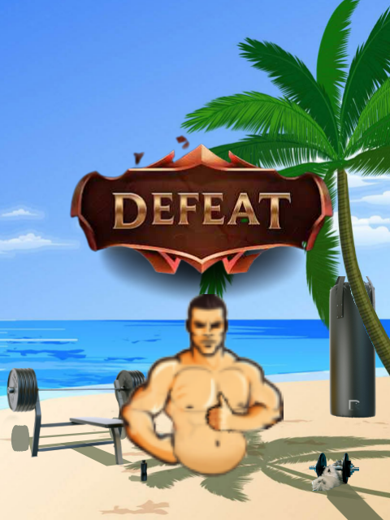

# Get Fit or Quit

A fast-paced arcade game built with Pygame where players must make healthy food choices to stay in shape while avoiding unhealthy snacks.

## Screenshots

<p align="center">
  
  
</p>

<p align="center">
  
  
</p>

<p align="center"><i>Catch healthy foods and avoid junk food to maintain your fitness!</i></p>

## Game Overview

Control a character who must catch healthy foods (salad and chicken breast) while dodging unhealthy treats (cake and ice cream). The challenge increases over time as more junk food appears on screen. Stay fit for 60 seconds to win, but get too unhealthy and you'll lose!

### Gameplay Mechanics

- **Objective**: Survive for 60 seconds by maintaining your fitness level
- **Controls**: Use LEFT and RIGHT arrow keys to move your character
- **Healthy Foods** (green indicator):
  - Salad: +3% fitness
  - Chicken Breast: +3% fitness
- **Unhealthy Foods** (red indicator):
  - Cake: -15% fitness
  - Ice Cream: -10% fitness
- **Character Changes**: Your character's size increases as you become less fit
- **Difficulty Phases**: The game gets progressively harder with more falling objects at 25s, 40s, and 50s

### Win/Loss Conditions

- **Win**: Reach 60 seconds with positive fitness level
- **Lose**: Fitness level drops to 0 or below

## Installation

### Prerequisites

- Python 3.6 or higher
- pip (Python package manager)

### Setup Instructions

1. Clone or download this repository:
```bash
git clone https://github.com/Dubu911/CalhacksProject.git
cd CalhacksProject
```

2. Install the required dependencies:
```bash
pip install -r requirements.txt
```

3. Run the game:
```bash
python main.py
```

## How to Play

1. Launch the game by running `python main.py`
2. Press CTRL on the keyboard to begin
3. Use LEFT and RIGHT arrow keys to move your character
4. Catch healthy foods (salad and chicken) to increase fitness
5. Avoid unhealthy foods (cake and ice cream) to prevent fitness loss
6. Survive 60 seconds to win!

## License

This project is open source and available for everybody.

## Credits

Developed by the chonkyBros

---

Enjoy the game and remember: Get Fit or Quit!
