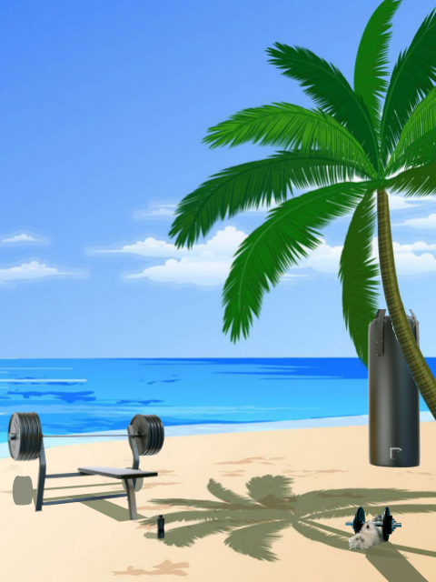

# Get Fit or Quit

A fast-paced arcade game built with Pygame where players must make healthy food choices to stay in shape while avoiding unhealthy snacks.

## Game Overview

Control a character who must catch healthy foods (salad and chicken breast) while dodging unhealthy treats (cake and ice cream). The challenge increases over time as more junk food appears on screen. Stay fit for 60 seconds to win, but get too unhealthy and you'll lose!

### Gameplay Mechanics

- **Objective**: Survive for 60 seconds by maintaining your fitness level
- **Controls**: Use LEFT and RIGHT arrow keys to move your character
- **Healthy Foods** (green indicator):
  - Salad: +3% fitness
  - Chicken Breast: +3% fitness
- **Unhealthy Foods** (red indicator):
  - Cake: -15% fitness
  - Ice Cream: -10% fitness
- **Character Changes**: Your character's size increases as you become less fit
- **Difficulty Phases**: The game gets progressively harder with more falling objects at 25s, 40s, and 50s

### Win/Loss Conditions

- **Win**: Reach 60 seconds with positive fitness level
- **Lose**: Fitness level drops to 0 or below

## Screenshots

### Start Screen


### Gameplay


*Catch healthy foods and avoid junk food to maintain your fitness!*

### Win Screen


### Defeat Screen


## Installation

### Prerequisites

- Python 3.6 or higher
- pip (Python package manager)

### Setup Instructions

1. Clone or download this repository:
```bash
git clone https://github.com/Dubu911/CalhacksProject.git
cd CalhacksProject
```

2. Install the required dependencies:
```bash
pip install -r requirements.txt
```

3. Run the game:
```bash
python main.py
```

## How to Play

1. Launch the game by running `python main.py`
2. Press SPACE on the start screen to begin
3. Use LEFT and RIGHT arrow keys to move your character
4. Catch healthy foods (salad and chicken) to increase fitness
5. Avoid unhealthy foods (cake and ice cream) to prevent fitness loss
6. Survive 60 seconds to win!

## Game Configuration

You can adjust the difficulty by modifying the settings at the top of `main.py`:

```python
phase2_start = 25        # When phase 2 begins (in seconds)
phase3_start = 40        # When phase 3 begins (in seconds)
phase4_start = 50        # When phase 4 begins (in seconds)
default_speed = 0.6      # Base falling speed of objects
main_char_coefficient = .6  # Starting fitness level (higher = fitter)
```

## Project Structure

```
CalhacksProject/
├── main.py                    # Main game logic and loop
├── function.py                # Utility functions (gravity calculations)
├── requirements.txt           # Python dependencies
├── README.md                  # This file
├── background.png             # Game background
├── startingPage.png           # Start screen
├── WinScreen.png              # Victory screen
├── DefeatScreen.png           # Game over screen
├── character.png              # Normal character sprite
├── biggercharacter.png        # Slightly overweight character
├── biggerercharacter.png      # Very overweight character
├── salad.png                  # Salad item sprite
├── chickenBreast.png          # Chicken breast item sprite
├── cake.png                   # Cake item sprite
├── icecream.png               # Ice cream item sprite
├── EatHealthy.png             # Positive feedback effect
└── EatUnhealthy.png           # Negative feedback effect
```

## Technical Details

- **Engine**: Pygame
- **Resolution**: 480x640 pixels
- **Frame Rate**: 60 FPS
- **Language**: Python 3

## Development

This project was created as a collaborative effort. The game demonstrates:
- Sprite rendering and animation
- Collision detection
- Dynamic difficulty scaling
- Game state management
- Event-driven programming with Pygame

## Known Issues

- The gravity function in `function.py` is currently unused in the main game loop

## License

This project is open source and available for educational purposes.

## Credits

Developed by the CalhacksProject team.

---

Enjoy the game and remember: Get Fit or Quit!
